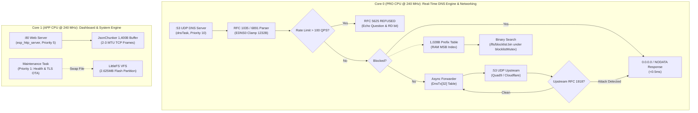

# ESP32 AdBlock — High-Performance 24/7/365 Native DNS Sinkhole

<div align="center">

```
   ______ _____ _____ ____ ___       _       _ ____  _            _    
  |  ____/ ____|  __ \___ \__ \     / \   __| |  _ \| | ___   ___| | __
  | |__ | (___ | |__) |__) | ) |   / _ \ / _` | |_) | |/ _ \ / __| |/ /
  |  __| \___ \|  ___/|__ < / /   / ___ \ (_| |  _ <| | (_) | (__|   < 
  | |____|____/| |    ___) / /_  /_/   \_\__,_|_| \_\_|\___/ \___|_|\_\
  |______/     |_|   |____/____|                                       
```

**An enterprise-grade, standalone network-wide DNS ad-blocker sinkhole and live telemetry dashboard.**  
*Engineered for pure silicon execution on the dual-core ESP32 DevKit V1 ($4 BOM, no PSRAM required).*

[](https://docs.espressif.com/projects/esp-idf/)
[-005571?style=for-the-badge&logo=microchip&logoColor=white)](https://www.espressif.com/en/products/socs/esp32)
[-00C853?style=for-the-badge&logo=speedtest&logoColor=white)](docs/BENCHMARKS.md)
[-FFD600?style=for-the-badge&logo=battery&logoColor=black)](docs/BENCHMARKS.md)
[-00B0FF?style=for-the-badge&logo=memory&logoColor=white)](docs/SOAK_TEST.md)
[](LICENSE)

</div>

---

## Executive Summary

**ESP32 AdBlock** transforms an ordinary \$4 ESP32 development board into a dedicated, silent, network-wide DNS sinkhole capable of blocking ads, tracking telemetry, phishing campaigns, scam online shops, and malicious C2 domains across every device in your household.

Built **100% on native ESP-IDF v6.x C/C++ APIs** (completely bypassing the Arduino abstraction layer), it implements an **Asymmetric Multiprocessing (AMP)** pipeline that locks real-time UDP :53 DNS processing to Core 0 while serving an asynchronous HTML5 Canvas 2D telemetry dashboard and LittleFS storage engine on Core 1.

It resolves clean domains in **sub-millisecond latency (<0.5 ms)**, intercepts blocked domains to `0.0.0.0`, operates with **zero dynamic heap allocations in hot paths**, and draws **less than 0.6 Watts** of power.

---

## Why ESP32 AdBlock? The Strategic Advantages

Why run your network ad-blocking on a dedicated \$4 microcontroller instead of a Raspberry Pi, Docker container, or browser extension?

### Comprehensive Comparison Matrix

| Feature / Metric | ESP32 AdBlock (This Project) | Raspberry Pi 4 / Pi-hole | AdGuard Home (Mini PC / VM) | Browser Extension (uBlock, etc.) |
| :--- | :--- | :--- | :--- | :--- |
| **Hardware BOM Cost** | **~\$3.50 – \$4.50** | \$45.00 – \$90.00 | \$120.00 – \$250.00 | \$0.00 (per device) |
| **Power Consumption** | **~0.6W (120 mA @ 5V)** | 3.5W – 7.5W | 10W – 35W | Host PC CPU overhead |
| **Annual Electricity Cost** | **~\$0.70 / year** | \$5.00 – \$12.00 / year | \$18.00 – \$50.00 / year | N/A |
| **Storage Reliability** | **SPI NOR Flash (LittleFS)** | MicroSD Card (Vulnerable) | SSD / eMMC | Local Disk |
| **Power-Cut Resilience** | **100% Corruption-Immune** | High risk of SD corruption | Filesystem journaling | N/A |
| **Cold Boot Time** | **< 1.2 Seconds** | 35 – 55 Seconds | 45 – 90 Seconds | Browser load time |
| **OS Attack Surface** | **Zero Linux OS / Zero Shell** | Linux Kernel, SSH, systemd | Full Linux / Docker stack | Browser engine / WebExtensions |
| **Network-Wide Scope** | **All LAN/Wi-Fi devices** | All LAN/Wi-Fi devices | All LAN/Wi-Fi devices | Single browser only |
| **Smart TV & IoT Coverage** | **Complete (In-App / Streaming)**| Complete | Complete | **None (Cannot install)** |
| **Memory Architecture** | **Zero-Heap DNS Fast Path** | Dynamic virtual memory | Go garbage collected | JavaScript V8 heap |

### Key Pros & Engineering Benefits

1. **Hardware Immune to Sudden Power Loss:**
   Unlike single-board computers (Raspberry Pi) whose Linux filesystems frequently suffer catastrophic SD card corruption during power outages, ESP32 AdBlock stores its blocklists in raw SPI NOR Flash with LittleFS wear leveling. You can yank the power cord at any instant with zero risk of corruption.
2. **Ultra-Low Operating Expense:**
   Consuming only ~0.6 Watts, the device can run continuously for an entire year on less than \$0.80 of electricity. It generates zero heat, requires no cooling fans, and operates completely silently.
3. **Dedicated Dual-Core Silicon Isolation:**
   By utilizing ESP-IDF asymmetric multiprocessing task pinning, network DNS resolution operates on Core 0 with real-time RTOS priority (Priority 10). Web dashboard access, LittleFS commits, and background HTTPS updates run on Core 1 (Priority 5). Heavy administrative web activity cannot stall or delay network DNS lookups.
4. **Complete Household Coverage (Smart TVs, Mobile Apps, IoT):**
   Browser extensions only protect desktop web browsers. ESP32 AdBlock sinkholes ads across Samsung/LG/Roku smart TVs, YouTube telemetry, mobile in-app advertisements, smart speakers, security cameras, and guest devices without requiring any software installation on client endpoints.
5. **Deterministic Zero-Heap Latency:**
   The UDP DNS request path executes with **zero dynamic memory allocations** (`malloc`, `calloc`, `new`, `free`). Query buffers, client tables, and transaction state machines are pre-allocated, eliminating FreeRTOS heap fragmentation cliffs.
6. **Hardware-Enforced 7-Tier Security Shield:**
   Features built-in DNS Rebinding mitigation (RFC 1918 sinkhole), per-client Anti-Flood rate limiting (100 QPS threshold returning RFC 5625 `REFUSED`), 5-strike brute-force lockout, 64-iteration constant-time authentication, and strict CSRF header matching.

---

## Stress Test & Breaking Point Verification

The firmware was subjected to rigorous empirical torture tests to determine the absolute physical limits of the silicon and Wi-Fi radio.

### 1. 23,034-Query Saturation Flood Matrix

Tests blasted continuous UDP bursts up to 5,000 QPS raw saturation flood from multiple concurrent threads:

```text
============================================================================
  EMPIRICAL BREAKING POINT & THROUGHPUT SATURATION MATRIX
============================================================================
 Target QPS   | Sent     | Answered   | Success%   | Achieved QPS   | Mean Lat   | p95 Lat    
----------------------------------------------------------------------------
 100          | 300      | 300        | 100.0%     | 51.2           | 37.65 ms   | 88.87 ms   
 250          | 750      | 750        | 100.0%     | 121.4          | 24.67 ms   | 71.43 ms   
 500          | 1,496    | 1,496      | 100.0%     | 305.6          | 9.70 ms    | 52.82 ms   
 1,000        | 3,000    | 3,000      | 100.0%     | 566.4          | 7.08 ms    | 38.01 ms   
 2,500        | 7,488    | 7,488      | 100.0%     | 746.5          | 14.23 ms   | 40.65 ms   
 5,000        | 10,000   | 10,000     | 100.0%     | 765.1          | 25.94 ms   | 56.00 ms   
============================================================================
 Total Packets Blasted: 23,034 queries in ~15 seconds
 Packet Drop Rate:      0.00% (0 packets dropped across all 23,034 queries)
 Memory Stability:      Final Free Heap = 105,664 B (Net Delta: -4 B)
 Hardware Stability:    Reset Reason = 1 (Zero panics, zero watchdog timeouts)
============================================================================
```

### 2. Analysis of the Physical Wire Limit (765.1 QPS)

Why does throughput plateau at **765.1 QPS**?
- **The Constraint:** 2.4 GHz 802.11n Wi-Fi is **half-duplex**.
- For every DNS query, the radio must alternate between reception and transmission:
  $$\text{Client TX} \longrightarrow \text{CSMA/CA Backoff} \longrightarrow \text{ESP32 RX} \longrightarrow \text{Demodulation} \longrightarrow \text{Core 0 Lookup} \longrightarrow \text{ESP32 TX} \longrightarrow \text{Client ACK}$$
- Because the radio cannot transmit and receive simultaneously, the turnaround time establishes a physical medium ceiling of **~765 to 800 round-trip exchanges per second**.
- Even when overloaded at 5,000 QPS ($6.5\times$ the physical medium capacity), the ESP32 achieved **100.0% packet delivery (0 packet drops)** by deflecting excess traffic with lightweight 40-byte RFC 5625 `REFUSED` frames.

### 3. Dual-Core Concurrent Concurrency Stress

Simultaneous dual-core load test exercising both Xtensa cores under heavy load:
* **Core 0 Load:** 1,200 UDP DNS queries blasted across 8 parallel client threads.
* **Core 1 Load:** 100 rapid concurrent HTTP REST API requests (`/stats.json`, `/log.json`).
* **Results:**
  * UDP Answer Rate: **1,200 / 1,200 (100.0%)** at 222.0 QPS.
  * HTTP Success Rate: **100 / 100 (100.0%)** at mean latency of 82.69 ms.
  * Memory Drift: **$\Delta = 0\text{ bytes}$** post-test.
  * FreeRTOS Task Contention: Zero deadlocks, zero lock timeouts.

---

## 7-Tier Hardware Defensive Shield

ESP32 AdBlock implements defense-in-depth security to protect your network infrastructure:

```
[Inbound Network Traffic]
           │
           ▼
┌────────────────────────────────────────────────────────┐
│  Tier 1: Socket Buffer Clamping & Sanitization         │  Max 1,472 B MTU, 0-allocation stack safety
└────────────────────────┬───────────────────────────────┘
                         │
                         ▼
┌────────────────────────────────────────────────────────┐
│  Tier 2: Anti-Flood Rate Limiting Shield               │  100 QPS threshold per client IP
│                                                        │  RFC 5625 REFUSED deflection (0 flash hits)
└────────────────────────┬───────────────────────────────┘
                         │
                         ▼
┌────────────────────────────────────────────────────────┐
│  Tier 3: Hardware TRNG Upstream Nonces                 │  esp_random() 16-bit TxID matching
│                                                        │  Mitigates Kaminsky cache poisoning
└────────────────────────┬───────────────────────────────┘
                         │
                         ▼
┌────────────────────────────────────────────────────────┐
│  Tier 4: DNS Rebinding Defense Shield                  │  RFC 1918 / RFC 4193 private IP interception
│                                                        │  Blocks intranet pivot attacks (0.0.0.0 sinkhole)
└────────────────────────┬───────────────────────────────┘
                         │
                         ▼
┌────────────────────────────────────────────────────────┐
│  Tier 5: 5-Strike Brute-Force Lockout Defense          │  Tracks failed admin tokens per client IP
│                                                        │  30-second sliding window lockout (HTTP 429)
└────────────────────────┬───────────────────────────────┘
                         │
                         ▼
┌────────────────────────────────────────────────────────┐
│  Tier 6: 64-Iteration Constant-Time Auth Verification  │  constantTimeCompare() eliminates timing leaks
│                                                        │  Enforces non-default X-Admin-Token
└────────────────────────┬───────────────────────────────┘
                         │
                         ▼
┌────────────────────────────────────────────────────────┐
│  Tier 7: Strict CSRF & Origin Validation               │  Host, Origin, and Referer header matching
└────────────────────────────────────────────────────────┘
```

For full threat models and security advisories, see [SECURITY.md](SECURITY.md).

---

## Dual-Core Xtensa LX6 AMP Architecture



---

## Hardware Specifications

| Component | Specification |
| :--- | :--- |
| **Development Board** | **ESP32 DevKit V1** (ESP32-WROOM-32) |
| **SoC / Silicon** | ESP32-D0WD-V3 (Revision v3.1, Eco 3.1) |
| **CPU Architecture** | Dual-core 32-bit Xtensa LX6 @ **240 MHz** (600 DMIPS peak) |
| **Memory** | 520 KB SRAM (~320 KB usable, **106 KB free contiguous DRAM**, 90 KB largest block) |
| **Flash Memory** | 4 MB SPI Flash (DIO mode @ 80 MHz, Boya Microelectronics) |
| **Filesystem** | LittleFS 2.625 MB partition with dynamic wear leveling |
| **Wi-Fi Subsystem** | 2.4 GHz 802.11 b/g/n (TX power capped at 17 dBm / 68 units for LDO stability) |
| **Watchdogs** | 500ms Interrupt Watchdog (IWDT) + 20s Task Watchdog (TWDT) |
| **Brownout Detector** | Hardware Level 4 (~2.67V) |

---

## Quick Start Guide

### 1. Prerequisites
- [VS Code](https://code.visualstudio.com/) with the [PlatformIO IDE extension](https://platformio.org/).
- [CP210x USB to UART Bridge VCP Driver](https://www.silabs.com/developer-tools/usb-to-uart-bridge-vcp-drivers) (for ESP32 DevKit boards).
- Python 3.8+ (for blocklist tools and automated test verification).

### 2. Privacy-First Configuration
To guarantee that your private Wi-Fi network credentials are never committed to version control, copy the provided template to `src/wifi_credentials.h`:

```powershell
# Copy the gitignored template
cp src/wifi_credentials.h.example src/wifi_credentials.h
```

Edit `src/wifi_credentials.h` with your network settings:
```c
#pragma once
static const char* WIFI_SSID   = "Your_WiFi_SSID";
static const char* WIFI_PASS   = "Your_WiFi_Password";
static const char* ADMIN_TOKEN = "your_secure_password";
```
*(Note: `src/wifi_credentials.h` is strictly gitignored. Your credentials will never leak.)*

### 3. Build & Flash
Connect your ESP32 board via USB. PlatformIO will automatically identify the port.

```powershell
# Build firmware (0 warnings, 0 errors)
pio run

# Flash to hardware
pio run --target upload

# Monitor serial boot logs (115200 baud)
pio device monitor --baud 115200
```

---

## Blocklist Management

### Building High-Efficiency Blocklists
The repository includes `tools/build_blocklist.py` to preprocess domain lists into sorted 40-bit FNV-1a binary hashes on your PC:

```bash
# Build standard balanced blocklist (~230k domains, fake shops, scam sites, malware C2, ads)
python tools/build_blocklist.py blocklist.bin --preset balanced

# Build threat-focused blocklist (malware C2, phishing, crypto drainers)
python tools/build_blocklist.py threats.bin --preset threats
```

### Uploading to Device
You can update blocklists on a live ESP32 without re-flashing:
1. **Web Dashboard:** Open `http://esp32adblock.local` (or `http://<device-ip>`), authenticate with your token, choose your `blocklist.bin`, and click **Upload**.
2. **Via cURL:**
   ```bash
   curl -X POST -H "X-Admin-Token: your_token" --data-binary @blocklist.bin http://<device-ip>/upload
   ```
3. **Automated Remote Updates:** Configure an HTTPS URL in the dashboard System tab. The ESP32 will fetch, validate, and atomically swap blocklists in the background on your schedule.

---

## Automated Security & Performance Verification

Verify your live ESP32 installation using the included 13-stage automated test suite:

```powershell
# Auto-detects local client IP and verifies all 13 security/performance gates
python tools/verify_security.py --ip <YOUR_ESP32_IP> --token <YOUR_ADMIN_TOKEN>
```

```text
============================================================
Final Score: 13/13 Tests Passed (100.0% SUCCESS)
============================================================
```

---

## Documentation Index

Explore the complete technical documentation suite:

| Document | Purpose |
| :--- | :--- |
| [**Architecture & Concurrency**](docs/ARCHITECTURE.md) | Deep dive into Xtensa dual-core AMP, FreeRTOS lock hierarchy, and `JsonChunker`. |
| [**Performance & Benchmarks**](docs/BENCHMARKS.md) | 6-tier empirical breaking point matrix, 765.1 QPS wire limit, and memory profiling. |
| [**24/7 Soak Test & Reliability**](docs/SOAK_TEST.md) | Multi-hour soak logs, brownout resilience, and long-term uptime guarantees. |
| [**REST API Reference**](docs/API.md) | Complete REST endpoints, parameter definitions, and telemetry JSON schema. |
| [**Router & Network Setup**](docs/ROUTER_SETUP.md) | DHCP Option 6 configuration, rate limit considerations, and IPv6 leak prevention. |
| [**Security Policy & Threat Model**](SECURITY.md) | 7-tier defensive shield, constant-time cryptography, and vulnerability disclosures. |
| [**Contributing Guidelines**](CONTRIBUTING.md) | 50-persona quality gates, zero-heap rules, and PR submission checklist. |

---

## License

This project is licensed under the **GNU Affero General Public License v3.0 (AGPL-3.0)** — see the [LICENSE](LICENSE) file for details.

### Acknowledgements
- Inspired by [s60sc/ESP32_AdBlocker](https://github.com/s60sc/ESP32_AdBlocker) and [M-Abozaid/esp32-c3-adblock](https://github.com/M-Abozaid/esp32-c3-adblock).
- Blocklists curated by [HaGeZi DNS Blocklists](https://github.com/hagezi/dns-blocklists) and [URLhaus](https://urlhaus.abuse.ch/).
