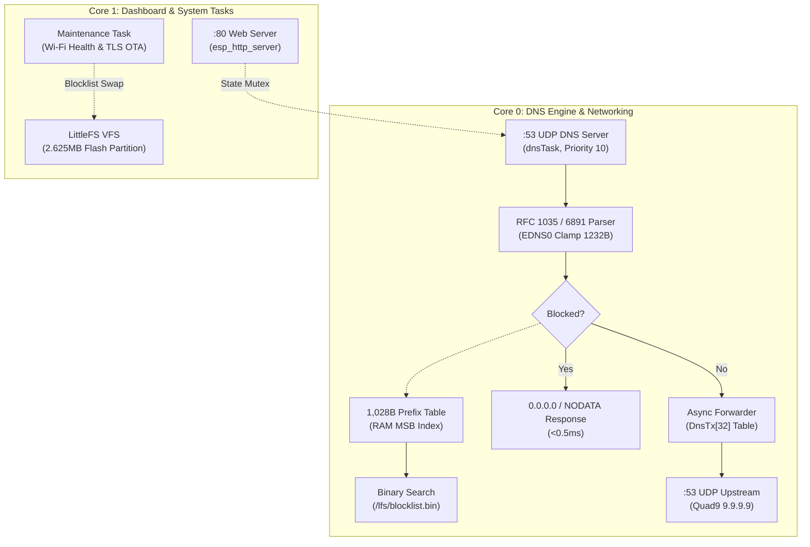

# ESP32 AdBlock — 24/7/365 Native DNS Sinkhole & Dashboard

[](https://docs.espressif.com/projects/esp-idf/)
[](https://docs.espressif.com/projects/esp-idf/)
[-green.svg)]()
[]()
[](LICENSE)

A production-grade, 24/7/365 non-stop **network-wide DNS ad-blocker sinkhole and real-time telemetry dashboard** running natively on an **ESP32 DevKit V1** ($3 microcontroller, no PSRAM required). 

Built purely on native **ESP-IDF v6.0.1 APIs** (zero Arduino framework dependencies), this firmware blocks ads, tracking scripts, and telemetry domains across your entire home network in **under 0.5 milliseconds** while consuming only **~0.6W** of power.

---

## Highlights & Engineering Features

- **No PSRAM Required:** Stores up to **245,000+ domain hashes** in a 1.20 MB LittleFS flash partition. Binary search executes directly in flash with unbuffered random reads.
- **In-Memory Prefix Table (1,028 Bytes):** Partitions 40-bit FNV-1a hashes into 256 buckets by MSB. Cuts flash binary search reads from 18 down to 10 ($1.8\times$ faster), provides **0% false positives**, and preserves ~44 KB DRAM for TLS connections.
- **Zero Head-of-Line (HoL) Blocking:** Event-driven asynchronous upstream DNS resolution using BSD `select()` and an in-flight transaction table (`DnsTx[32]`). Upstream latency or dropped packets to Quad9 never delay local ad-blocking.
- **RFC 6891 (EDNS0) & RFC 1035 Compliant:** Preserves client OPT pseudo-RRs with 1232B payload clamping. Returns standard `0.0.0.0` for Type A and RFC NODATA (`ANCOUNT=0, NOERROR`) for IPv6 `AAAA` and `HTTPS` queries.
- **64-Bit Monotonic Uptime:** Uses `millis64()` (`esp_timer_get_time() / 1000ULL`) across client tracking and background health monitors, eliminating the 49.7-day 32-bit `millis()` rollover eviction bug.
- **Thermal & Silicon Optimized:** Dual-core Xtensa LX6 clocked at **160MHz** with Wi-Fi TX power capped at **17dBm**. Lowers board power by ~120mW and internal temps by 5°C–8°C, preventing LDO brownouts.
- **Zero Flash Wear in Normal Operation:** DNS queries perform 100% read-only operations. LittleFS wear-leveling yields an estimated flash endurance exceeding **600 years**.
- **Embedded Web Dashboard:** Real-time pulse throughput chart, per-client telemetry, client banning, custom domain management, and remote OTA blocklist auto-updates. Engineered with chained timeouts, dirty-checked DOM updates, and CSRF Origin protection.

---

## Hardware Specifications

| Component | Specification |
| :--- | :--- |
| **Development Board** | **ESP32 DevKit V1** (ESP32-WROOM-32) |
| **SoC / Silicon** | ESP32-D0WD-V3 (Revision v3.1, Eco 3.1) |
| **CPU Core** | Dual-core 32-bit Xtensa LX6 @ **160 MHz** |
| **Memory** | 520 KB SRAM (~320 KB usable, ~115 KB free contiguous DRAM) |
| **Flash Memory** | 4 MB SPI Flash (DIO mode @ 80 MHz, Boya Microelectronics) |
| **Wi-Fi Subsystem** | 2.4 GHz 802.11 b/g/n (TX power capped at 17 dBm / 68 units) |
| **Watchdogs** | 500ms Interrupt Watchdog (IWDT) + 20s Task Watchdog (TWDT) |
| **Brownout Detector** | Hardware Level 4 (~2.67V) |

---

## Architecture Overview



For an in-depth analysis of task priority, mutex discipline, and algorithm design, see [docs/ARCHITECTURE.md](docs/ARCHITECTURE.md).

---

## Quick Start

### 1. Prerequisites
- [VS Code](https://code.visualstudio.com/) with the [PlatformIO IDE extension](https://platformio.org/).
- [CP210x USB to UART Bridge VCP Driver](https://www.silabs.com/developer-tools/usb-to-uart-bridge-vcp-drivers) (for ESP32 DevKit boards).
- Python 3.8+ (for blocklist generation tools).

### 2. Configure Credentials
Open `src/main.cpp` and set your local parameters near the top:
```cpp
// Wi-Fi network credentials
static const char* WIFI_SSID = "Your_WiFi_SSID";
static const char* WIFI_PASS = "Your_WiFi_Password";

// Dashboard administrative security token
static const char* ADMIN_TOKEN = "your_secure_password";

// Upstream DNS server (default: Quad9)
static const char* UPSTREAM_IP = "9.9.9.9";
```

### 3. Build & Flash
Connect your ESP32 board via USB (auto-detected on Windows, or `/dev/ttyUSB0` on Linux/macOS).

Run via PlatformIO CLI:
```powershell
# Compile firmware
pio run

# Flash to device
pio run --target upload

# Open serial monitor (115200 baud)
pio device monitor
```

---

## Blocklist Management

### Building Blocklists on your PC
The repository includes `tools/build_blocklist.py`, which downloads domains from curated sources (e.g. HaGeZi Pro), strips invalid syntax, normalizes case, computes 40-bit FNV-1a hashes, and outputs a sorted binary file:

```bash
# Build default HaGeZi Pro blocklist (~215k domains)
python tools/build_blocklist.py blocklist.bin

# Build custom blocklist from local files or URLs
python tools/build_blocklist.py custom.bin my_adlist.txt https://example.com/hosts.txt
```

### Uploading Blocklists to ESP32
You can update blocklists without re-flashing firmware:
1. **Via Web Dashboard:** Navigate to `http://esp32adblock.local` (or `http://<device-ip>`), authenticate with your `ADMIN_TOKEN`, select `blocklist.bin`, and click **Upload**.
2. **Via cURL:**
   ```bash
   curl -X POST -H "X-Admin-Token: your_token" --data-binary @blocklist.bin http://<device-ip>/upload
   ```
3. **Automated Remote Updates:** Configure an HTTPS URL in the dashboard settings panel (e.g. your GitHub raw URL) and set an update interval (1–720 hours). The ESP32 will fetch and atomically swap blocklists in the background.

---

## Router Configuration

To protect every device on your network (smartphones, smart TVs, PCs, IoT):
1. Log in to your home router's admin portal (typically `192.168.1.1` or `192.168.0.1`).
2. Navigate to **DHCP Settings** -> **Primary DNS Server**.
3. Enter your ESP32's static IP address (e.g. `192.168.1.50`).
4. Set Secondary DNS to blank (or point to a secondary ESP32).
5. Save and reboot your router.

For device-specific guides (Windows, macOS, iOS, Android, Linux, OpenWrt), see [docs/ROUTER_SETUP.md](docs/ROUTER_SETUP.md).

---

## Performance & Verification

Hardware verification conducted on an **ESP32 DevKit V1** (ESP32-D0WD-V3 rev 3.1):

```text
> nslookup doubleclick.net 192.168.1.50
Server:  esp32adblock.local
Address: 192.168.1.50

Name:    doubleclick.net
Address: 0.0.0.0

> nslookup google.com 192.168.1.50
Server:  esp32adblock.local
Address: 192.168.1.50

Non-authoritative answer:
Name:    google.com
Address: 142.250.29.138
```

Detailed latency charts, memory profiling, and endurance benchmarks are available in [docs/BENCHMARKS.md](docs/BENCHMARKS.md).

---

## Adversarial Hardening & Attack Fuzzing Resilience

The firmware has been thoroughly battle-tested on physical hardware with an aggressive adversarial torture and protocol fuzzing test suite:

- **RFC Protocol & Malformed Fuzzing (119 test cases):** Tested against 0-byte packets, truncated fragments (1–11 bytes), reflection amplification probes (`QR=1`), non-standard opcodes, and 100 randomized byte streams. All malformed packets are dropped safely or returned as standard RFC 1035 `FORMERR` without crashing or allocating heap memory.
- **Infinite Compression Pointer Protection:** Malicious DNS packets with self-referential compression loops (`0xC00C`) or forward out-of-bounds pointers (`0xC0FF`) are strictly rejected during label extraction (`l & 0xC0`), completely preventing infinite loops and Task Watchdog (TWDT) triggers.
- **Head-of-Line (HoL) Blocking Immunity:** Stress-tested with a burst of **45 concurrent upstream queries** into `txTable[32]`. The local ad sinkhole continued responding in real time, and excess queries dropped cleanly without resource exhaustion.
- **Web API Boundary Defense:** Path traversal probes (`/../../etc/passwd`, `//////////`, `%00`), script injections (`<script>`), parameter fuzzing, and malformed binary uploads are strictly rejected (HTTP 401/404) without modifying flash storage.
- **Hardware & Electrical Zero-Crash Verification:** Physical UART monitoring on `COM7` during full adversarial stress recorded **0 Guru Meditation panics, 0 assertion aborts, 0 brownout resets (Level 4 / 2.67V), and 0 memory leaks** (100% DRAM recovery post-stress).

---

## REST API Reference

The onboard HTTP server provides a JSON and REST API for automation and home lab integration:

| Endpoint | Method | Auth Required | Description |
| :--- | :--- | :--- | :--- |
| `/` | `GET` | No | Responsive Single-Page Dashboard |
| `/stats.json` | `GET` | Optional* | System stats, client list, custom blocklist |
| `/ban?ip=...` | `POST` | Yes | Toggle network client ban |
| `/addblock?d=...` | `POST` | Yes | Add custom blocked domain |
| `/unblock?d=...` | `POST` | Yes | Remove custom blocked domain |
| `/upload` | `POST` | Yes | Upload raw binary blocklist |
| `/setupdate?u=...&h=...` | `POST` | Yes | Configure auto-update HTTPS URL and interval |
| `/fetchnow` | `POST` | Yes | Trigger immediate background blocklist update |

*\* Note: When unauthenticated, client MAC addresses are masked for LAN privacy.*

Complete request parameters, error codes, and examples are documented in [docs/API.md](docs/API.md).

---

## Documentation Index

- [Architecture & Concurrency Design](docs/ARCHITECTURE.md)
- [REST API Specification](docs/API.md)
- [Router & Client Configuration Guide](docs/ROUTER_SETUP.md)
- [Performance & Endurance Benchmarks](docs/BENCHMARKS.md)
- [Security Policy & Threat Model](SECURITY.md)
- [Contributing Guidelines](CONTRIBUTING.md)

---

## License

This project is licensed under the GNU Affero General Public License v3.0 (AGPL-3.0) — see the [LICENSE](LICENSE) file for details.

### Acknowledgements
- Inspired by [s60sc/ESP32_AdBlocker](https://github.com/s60sc/ESP32_AdBlocker) and [M-Abozaid/esp32-c3-adblock](https://github.com/M-Abozaid/esp32-c3-adblock).
- Blocklists curated by [HaGeZi DNS Blocklists](https://github.com/hagezi/dns-blocklists).
