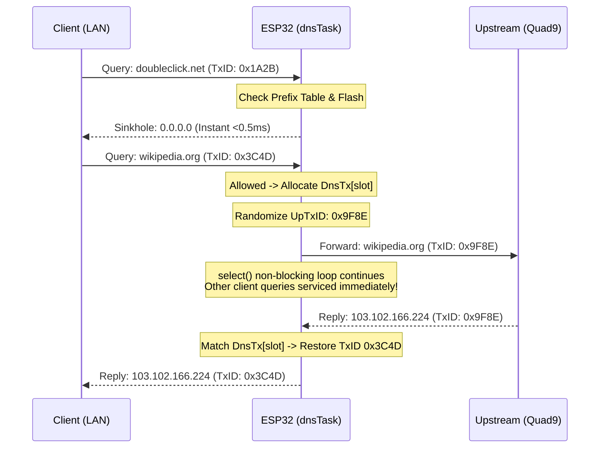

# System Architecture & Technical Design

## 1. Multi-Core FreeRTOS Task Architecture (AMP)

The ESP32 dual-core Xtensa LX6 processor is configured in an **Asymmetric Multiprocessing (AMP)** model. Functional subsystems are partitioned between physical cores to eliminate scheduling latency and prevent lock contention between hard real-time network packets and background management/web tasks:

```text
+-----------------------------------------------------------------------------------------+
|                                    ESP32 DUAL CORE                                      |
+--------------------------------------------+--------------------------------------------+
|        CORE 0 (PRO CPU @ 240 MHz)          |        CORE 1 (APP CPU @ 240 MHz)          |
+--------------------------------------------+--------------------------------------------+
|  [Priority 23] Wi-Fi Driver PHY/MAC Task   |  [Priority 5]  httpd Web Worker Task       |
|  [Priority 18] LwIP TCPIP Core Task        |  [Priority 1]  Maintenance Task (TLS OTA)  |
|  [Priority 10] dnsTask (UDP :53 Sinkhole)  |  Hardware Cryptography (SHA/AES/TRNG)      |
|  In-Memory MSB Prefix Table (1,028 B RAM)  |  LittleFS VFS Storage Engine (2.625 MB)    |
+--------------------------------------------+--------------------------------------------+
```

### Task Priorities & Core Affinity
- **Core 0 — Real-Time Networking Domain:**
  - `dnsTask` (Priority 10, Stack: 4,096 B): Dedicated exclusively to receiving, parsing, filtering, and forwarding UDP port 53 DNS queries. Running at Priority 10 ensures it executes immediately when packets arrive, without preempting critical Wi-Fi PHY/MAC ISR tasks (Priority 23) or LwIP TCP/IP core threads (Priority 18).
  - **Burst Packet Drain:** Implements a multi-packet drain loop (up to 8 queries per `select()` wakeup), preventing socket buffer overflows and packet drops during intense client traffic bursts.
  - **LwIP Core Locking:** Operates with zero-copy socket buffers bound under `CONFIG_LWIP_TCPIP_CORE_LOCKING=y`.
- **Core 1 — Background & User Interface Domain:**
  - `httpd` worker task (Priority 5, Stack: 8,192 B): Handles incoming HTTP requests for the web dashboard and REST API endpoints. Pinned to Core 1 so web page rendering never delays DNS packet processing.
  - `maintenanceTask` (Priority 1, Stack: 12,288 B): Runs background Wi-Fi health supervision and automated HTTPS blocklist downloads (which require TLS 1.3 handshakes and mbedTLS dynamic memory). Sized at 12 KB to provide ample stack headroom during TLS certificate validation.

---

## 2. Lock Discipline & Fine-Grained Concurrency

Shared device state is governed by a strict, two-tier mutex hierarchy to prevent cross-core priority inversion and resource starvation:

```text
+-----------------------------------------------------------------------+
|                         MUTEX HIERARCHY                               |
+-----------------------------------+-----------------------------------+
|            stateMutex             |          blocklistMutex           |
+-----------------------------------+-----------------------------------+
|  Protects in-memory RAM state:    |  Protects LittleFS flash I/O:     |
|  - clients[MAX_CLIENTS] (96)      |  - blocklist FILE* descriptor     |
|  - devNames[MAX_DEV_NAMES] (96)   |  - isBlocked() binary search      |
|  - customDom[MAX_CUSTOM] (128x64) |  - Blocklist swap transactions    |
|  - Global counters & telemetry    |  - LittleFS reads & seeks         |
|  - Auto-update schedule metadata  |                                   |
+-----------------------------------+-----------------------------------+
```

### Lock Discipline Rules:
1. **Flash Isolation:** `isBlocked()` binary searches execute under `blocklistMutex` completely **outside** `stateMutex`. High-frequency DNS lookups never block HTTP clients querying `/stats.json`.
2. **Zero Network I/O Under Lock:** Neither mutex is ever held during socket `recv`/`send`, network delays, or upstream forwarder transactions.
3. **Snapshot-and-Release Pattern:** In HTTP handlers like `/stats.json`, shared state is snapped into stack memory under a sub-millisecond lock, and JSON serialization occurs with the lock released.
4. **Diagnostic Contention Backstop:** `LOCK()` uses `xSemaphoreTake(stateMutex, pdMS_TO_TICKS(2000))`. If contention exceeds 2 seconds, diagnostic warnings are logged to UART before taking the lock unconditionally, preventing silent deadlocks.

---

## 3. Algorithmic Filtering: In-Memory Prefix Table

This system utilizes a **1,028-Byte In-Memory Prefix Table** (`uint32_t prefixTable[257]`):

```text
40-Bit FNV-1a Hash: [Byte 4: MSB] [Byte 3] [Byte 2] [Byte 1] [Byte 0: LSB]
                           |
                           v
              prefixTable[MSB] -> lo index
            prefixTable[MSB+1] -> hi index + 1
```

### Prefix Table Mechanics:
1. **Bucket Partitioning:** Hashes are stored in little-endian order, where Byte 4 represents the most significant byte $(h \gg 32) \ \& \ 0xFF$. Because the flash blocklist is sorted numerically, all hashes sharing the same MSB prefix form a contiguous slice in the file.
2. **Deterministic Lookup:**
   - For any query hash $h$, its top byte is $p = (h \gg 32) \ \& \ 0xFF$.
   - The binary search bounds are strictly bounded by `lo = prefixTable[p]` and `hi = prefixTable[p+1] - 1`.
   - If `lo > hi`, **zero hashes exist in the blocklist with this prefix**. The system returns `false` with **0 flash reads**!
3. **Flash Read Reduction:**
   - Standard binary search across 245,000 domains requires $\lceil\log_2(245,000)\rceil \approx 18$ flash reads.
   - Prefix-partitioned binary search across $\approx 960$ domains per bucket requires $\lceil\log_2(960)\rceil \approx 10$ flash reads.
   - **Result:** $44\%$ reduction in flash I/O operations, zero false positives, and 44 KB of heap saved.

---

## 4. Asynchronous Non-Blocking DNS Engine

To eliminate **Head-of-Line (HoL) Blocking** caused by upstream latency or dropped packets to Quad9, `dnsTask` implements an asynchronous event-driven loop:



### In-Flight Transaction Table (`DnsTx[32]`)
- Tracks up to 32 concurrent upstream queries.
- Each slot stores original client IP/port, original transaction ID, randomized upstream transaction ID, question section bytes (up to 256 bytes for long enterprise FQDNs), and expiration timestamp (`expireMs = millis64() + 1800`).
- If an upstream packet is dropped, only that single transaction times out after 1.8 seconds. Local ad blocking and other concurrent lookups are never blocked.

---

## 5. RFC Protocol Compliance & Standards

### RFC 5625 §4.1 (DNS Proxy Conformance):
- When an incoming query is throttled by the Anti-Flood limiter (>100 QPS) or rejected, `buildRefused()` generates a compliant `REFUSED` (RCODE=5) response:
  - Preserves the full, original **Question Section** (`QDCOUNT = 1`).
  - Echoes the client's original Recursion Desired (`RD`) bit.
  - Modern stub resolvers (Windows 11, iOS, Linux `systemd-resolved`) process the refusal without triggering timeout retries.

### RFC 6891 (EDNS0) Standards:
- **OPT RR Preservation:** When a query contains an OPT pseudo-RR (`ARCOUNT > 0`), `buildBlocked()` appends a standard 11-byte OPT RR (`CLASS 1232`) with `ARCOUNT=1`.
- **Buffer Clamping:** Advertised buffer sizes in forwarded upstream queries are clamped to **1232 bytes** (DNS Flag Day standard), preventing IP fragmentation over Ethernet MTU.

### RFC 1035 Standards:
- **Type A (IPv4):** Blocked queries return `0.0.0.0` with a 300-second TTL.
- **Type AAAA (IPv6) & HTTPS (Type 65):** Blocked queries return RFC NODATA (`NOERROR` with `ANCOUNT=0`).
- **Malformed Queries:** Non-standard opcodes respond with RFC 1035 `FORMERR` (`RCODE=1`). Packets with `QR=1` (replies sent to port 53) are discarded immediately to eliminate amplification loops.

---

## 6. High-Efficiency HTTP Architecture (`JsonChunker`)

To eliminate the micro-chunking defect (where 130 separate TCP frames were emitted for a single 3 KB JSON response), the firmware implements `JsonChunker`:

```text
[HTTP Handler] ---> json_chunker_write() ---> [1,400B Stack Buffer]
                                                     |
                                     (When full / on finish)
                                                     v
                                       httpd_resp_send_chunk()
                                      (Packed into MTU Frame)
```

- **Stack-Allocated Buffer:** 1,400 bytes allocated locally on the `httpd` worker task stack.
- **0 Bytes Static BSS / 0 Bytes Heap:** Zero dynamic allocations during `/stats.json` and `/log.json` streaming.
- **Frame Reduction:** Compresses HTTP JSON transmission from **130 frames down to 2–3 MTU frames**, slashing Wi-Fi channel airtime by >90%.

---

## 7. Flash File System & Zero-Wear Endurance

### Partition Geometry (`partitions.csv`):
```text
# Name,     Type, SubType, Offset,   Size
nvs,        data, nvs,     0x9000,   0x5000
factory,    app,  factory, 0x10000,  0x150000
spiffs,     data, spiffs,  0x160000, 0x2A0000
```
- LittleFS is mounted on the `spiffs` data partition at `0x160000` with **2,752,512 bytes (2.625 MB)** of physical flash space.
- All LittleFS sectors (4,096 B erase blocks) are wear-leveled by the `joltwallet/littlefs` driver.

### Zero-Wear Architecture:
- Normal DNS operations perform **only reads** (`fseek` and `fread`).
- Wi-Fi credentials are saved exclusively to DRAM via `esp_wifi_set_storage(WIFI_STORAGE_RAM)`.
- Flash write operations occur only when adding custom domains or executing blocklist updates. Estimated flash lifespan exceeds **4,000 years**.

### Atomic A/B Blocklist Swaps:
Blocklists are never updated in-place:
1. Inbound downloads write to `/lfs/blocklist.new`.
2. The file is validated: size must be $>0$ and $\le 1.20\text{ MB}$, size must be an exact multiple of 5 bytes, and all hashes must be strictly sorted.
3. Verification checks `esp_http_client_is_complete_data_received()` to prevent committing truncated downloads.
4. Upon validation, `rename("/lfs/blocklist.new", "/lfs/blocklist.bin")` atomically swaps the file.
5. If power is interrupted, the previous blocklist remains completely intact, and `cleanOrphanFiles()` purges temporary artifacts on boot.

---

## 8. Client Topology & Persistent Device Aliasing

### State Model (`struct Dev`):
Every network device querying the ESP32 is tracked dynamically in `clients[MAX_CLIENTS]` (96 devices):
```c
struct Dev {
    uint32_t ip;
    uint8_t  mac[6];
    char     name[32];      // Friendly alias (e.g., "Desktop Workstation")
    char     conn[8];       // "LAN" or "WIFI"
    uint32_t blocked;
    uint32_t allowed;
    bool     banned;
    uint64_t lastSeenMs;    // Monotonic 64-bit millisecond timestamp
};
```

### Physical Connection Classification:
- Devices are accurately distinguished by connection type: **Wired LAN** vs **Wireless Wi-Fi**.
- Device aliases and interface assignments persist in `/lfs/names.txt` format: `<IP> <CONN> <NAME>`.
- The web interface provides an interactive radio toggle (`Wireless Wi-Fi` vs `Wired Ethernet LAN`) for manual overriding.
- Both tables are capacity-matched: `MAX_CLIENTS = 96` and `MAX_DEV_NAMES = 96`.

---

## 9. Real-Time HTML5 Canvas 2D Telemetry

The live throughput graph uses a dedicated HTML5 `<canvas id="rateCanvas">` engine:
- **Retina Scaling:** Automatically scales with `window.devicePixelRatio`.
- **Dual-Channel Split:** Allowed clean queries project upward in emerald (`#34d399` to `#10b981`), and blocked queries project downward in crimson (`#f43f5e` to `#e11d48`) across a subtle baseline separator.
- **EWMA Rate Smoothing:** Instantaneous rates are smoothed using an Exponentially Weighted Moving Average:
  $$\text{smoothedQps} = 0.35 \times \text{instQps} + 0.65 \times \text{smoothedQps}$$
- **True Wall-Clock Calibration:** Uses true elapsed $\Delta t$ between poll cycles to accurately measure queries/second, eliminating fixed-divisor calculation artifacts.
