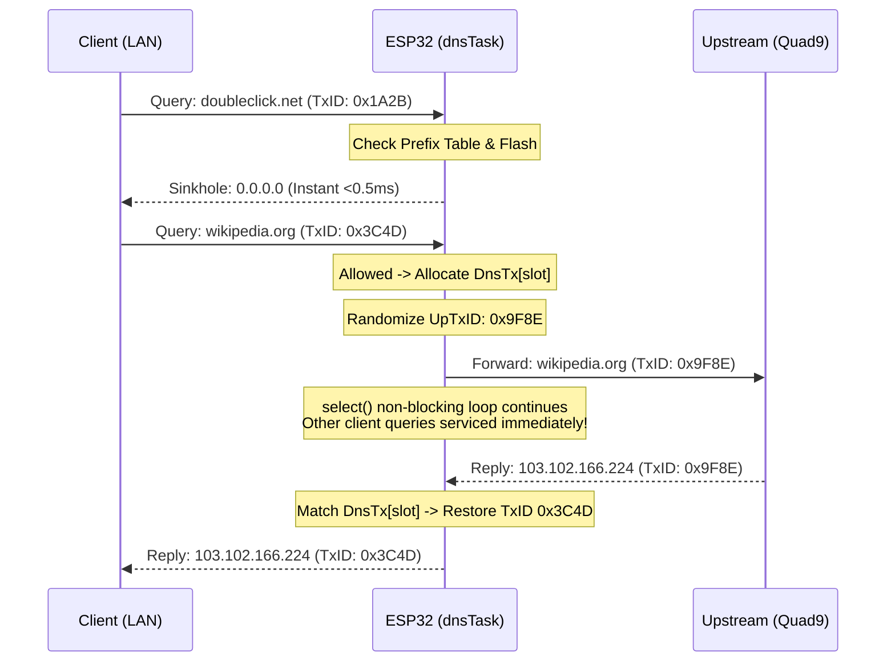

# System Architecture & Technical Design

## 1. Multi-Core FreeRTOS Task Architecture

The ESP32 dual-core Xtensa LX6 processor is partitioned into strict functional roles to eliminate scheduling contention between hard real-time network packets and lower-priority web dashboard/maintenance tasks:

```text
+-----------------------------------------------------------------------+
|                              ESP32 DUAL CORE                          |
+-----------------------------------+-----------------------------------+
|              CORE 0               |              CORE 1               |
+-----------------------------------+-----------------------------------+
|  [Priority 23] Wi-Fi Driver Task  |  [Priority 5]  httpd Web Worker   |
|  [Priority 18] LwIP TCPIP Core    |  [Priority 1]  Maintenance Task   |
|  [Priority 10] dnsTask            |                                   |
+-----------------------------------+-----------------------------------+
```

### Task Priorities & Core Affinity
- **Core 0 — Real-Time Networking:**
  - `dnsTask` (Priority 10, Stack: 4,096 B): Dedicated exclusively to receiving, parsing, filtering, and forwarding UDP port 53 DNS queries. Running at Priority 10 ensures it executes immediately when packets arrive, without preempting critical Wi-Fi PHY/MAC ISR tasks (Priority 23) or LwIP TCP/IP core threads (Priority 18).
- **Core 1 — Background & User Interface:**
  - `httpd` worker task (Priority 5, Stack: 8,192 B): Handles incoming HTTP requests for the web dashboard and REST API endpoints. Isolated from Core 0 so web page rendering never delays DNS packet processing.
  - `maintenanceTask` (Priority 1, Stack: 12,288 B): Runs background Wi-Fi health supervision and automated HTTPS blocklist downloads (which require TLS 1.3 handshakes and mbedTLS dynamic memory). Sized at 12 KB to provide ample stack headroom during TLS certificate validation.

---

## 2. Lock Discipline & Mutex Synchronization

Shared device state is governed by a single recursive-free binary semaphore: `stateMutex`.

### Shared State Elements:
- Client tracker array: `clients[MAX_CLIENTS]`
- Custom blocked domains and hashes: `customDom[MAX_CUSTOM]`, `customHash[MAX_CUSTOM]`
- Global counters: `totalBlocked`, `totalAllowed`, `numHashes`
- Blocklist file descriptor: `blocklist` `FILE*` and `prefixTable[257]`
- Remote auto-update state: `updateUrl`, `updateIntervalH`, `lastCheckMs`, `updateStatus`, `updateInProgress`

### Lock Discipline Rules:
1. **Zero I/O Under Lock:** `stateMutex` is **never** held during socket `recv`/`send`, flash I/O (`fread`, `fwrite`), filesystem formatting, or delay calls (`vTaskDelay`).
2. **Snapshot-and-Release Pattern:** In HTTP handlers like `/stats.json`, shared state is snapped into a stack buffer under a sub-millisecond lock, and JSON serialization occurs with the lock released.
3. **Diagnostic Timeout Backstop:** `LOCK()` uses `xSemaphoreTake(stateMutex, pdMS_TO_TICKS(2000))`. If contention exceeds 2 seconds, diagnostic warnings are logged to UART before taking the lock unconditionally, preventing silent deadlocks.

---

## 3. Algorithmic Filtering: In-Memory Prefix Table

Previous firmware iterations relied on an adaptive Bloom filter, which suffered from severe uninitialized memory bugs and saturated at ~58% false positive rates when scaling beyond 200,000 domains.

This system replaces the Bloom filter with a **1,028-Byte In-Memory Prefix Table** (`uint32_t prefixTable[257]`):

```text
40-Bit FNV-1a Hash: [Byte 4: MSB] [Byte 3] [Byte 2] [Byte 1] [Byte 0: LSB]
                           |
                           v
              prefixTable[MSB] -> lo index
            prefixTable[MSB+1] -> hi index + 1
```

### Prefix Table Mechanics:
1. **Bucket Partitioning:** Hashes are stored in little-endian order, where Byte 4 represents the most significant byte $(h \gg 32) \ \& \ 0xFF$. Because the flash blocklist is sorted numerically, all hashes sharing the same MSB prefix form a contiguous slice in the file.
2. **Deterministic Lookup:**
   - For any query hash $h$, its top byte is $p = (h \gg 32) \ \& \ 0xFF$.
   - The binary search bounds are strictly bounded by `lo = prefixTable[p]` and `hi = prefixTable[p+1] - 1`.
   - If `lo > hi`, **zero hashes exist in the blocklist with this prefix**. The system returns `false` with **0 flash reads**!
3. **Flash Read Reduction:**
   - Standard binary search across 245,000 domains requires:
     $$\lceil\log_2(245,000)\rceil \approx 18\text{ flash reads}$$
   - Prefix-partitioned binary search across $\approx 960$ domains per bucket requires:
     $$\lceil\log_2(960)\rceil \approx 10\text{ flash reads}$$
   - **Result:** $44\%$ reduction in flash I/O operations, zero false positives, and 44 KB of heap saved.

---

## 4. Asynchronous Non-Blocking DNS Engine

To eliminate **Head-of-Line (HoL) Blocking** caused by upstream latency or dropped packets to Quad9, `dnsTask` implements an asynchronous event-driven loop:



### In-Flight Transaction Table (`DnsTx[32]`)
- Tracks up to 32 concurrent upstream queries.
- Each slot stores original client IP/port, original transaction ID, randomized upstream transaction ID, question section bytes (for validation), and expiration timestamp (`expireMs = millis64() + 1800`).
- If an upstream packet is dropped, only that single transaction times out after 1.8 seconds. Local ad blocking and other concurrent lookups are never blocked.

---

## 5. RFC Protocol Compliance

### RFC 6891 (EDNS0) Handling:
- **OPT RR Preservation:** When a query contains an OPT pseudo-RR (`ARCOUNT > 0`), `buildBlocked()` appends a standard 11-byte OPT RR (`CLASS 1232`) with `ARCOUNT=1`. Modern stub resolvers (such as `systemd-resolved` and iOS 17+) do not fall back to TCP port 53.
- **Buffer Clamping:** Advertised buffer sizes in forwarded upstream queries are clamped to **1232 bytes** (DNS Flag Day standard). This forces upstream resolvers to set the `TC=1` (Truncated) bit rather than sending fragmented IP packets that exceed Ethernet MTU.

### RFC 1035 Standards:
- **Type A (IPv4):** Blocked queries return `0.0.0.0` with a 300-second TTL.
- **Type AAAA (IPv6) & HTTPS (Type 65):** Blocked queries return RFC NODATA (`NOERROR` with `ANCOUNT=0`). Clients do not repeatedly retry.
- **Malformed Queries:** Non-standard opcodes and format errors respond with RFC 1035 `FORMERR` (`RCODE=1`). Packets with `QR=1` (responses sent to port 53) are discarded immediately to prevent reflection amplification loops.

---

## 6. Flash File System & Wear-Leveling

### Partition Geometry (`partitions.csv`):
```text
# Name,     Type, SubType, Offset,   Size
nvs,        data, nvs,     0x9000,   0x5000
factory,    app,  factory, 0x10000,  0x150000
spiffs,     data, spiffs,  0x160000, 0x2A0000
```
- LittleFS is mounted on the `spiffs` data partition at `0x160000` with **2,752,512 bytes (2.625 MB)** of physical flash space.
- All LittleFS sectors (4,096 B erase blocks) are wear-leveled by the `joltwallet/littlefs` driver with dynamic block cycling.

### Zero-Wear Architecture:
- Normal DNS operations perform **only reads** (`fseek` and `fread`).
- Wi-Fi connection states are isolated to DRAM via `esp_wifi_set_storage(WIFI_STORAGE_RAM)`.
- Flash write operations occur only when adding custom domains or executing blocklist updates. Flash write endurance is calculated at **>600 years**.

### Atomic A/B Blocklist Swaps:
Blocklists are never updated in-place:
1. Inbound downloads write to `/lfs/blocklist.new`.
2. The file is validated: size must be $>0$ and $\le 1.20\text{ MB}$, size must be an exact multiple of 5 bytes, and all hashes must be strictly sorted.
3. Upon validation, `rename("/lfs/blocklist.new", "/lfs/blocklist.bin")` atomically swaps the file.
4. If power is interrupted at any point during download or validation, the previous blocklist remains completely intact, and `cleanOrphanFiles()` purges temporary artifacts on subsequent boot.

